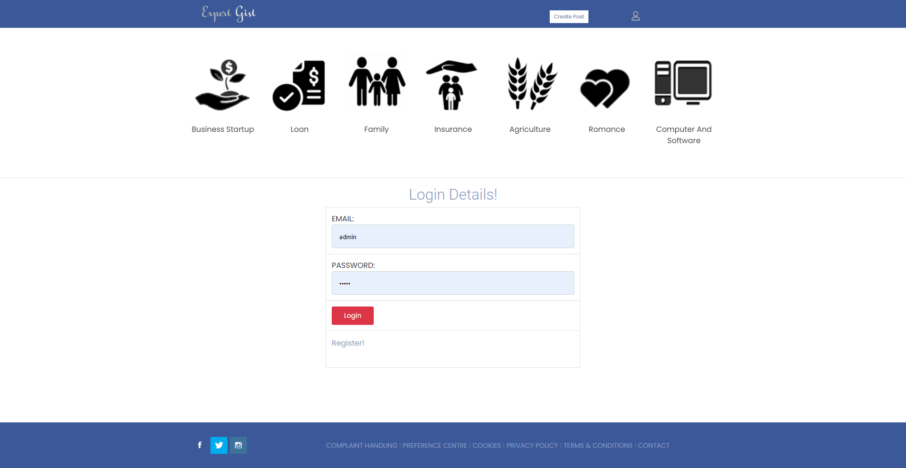
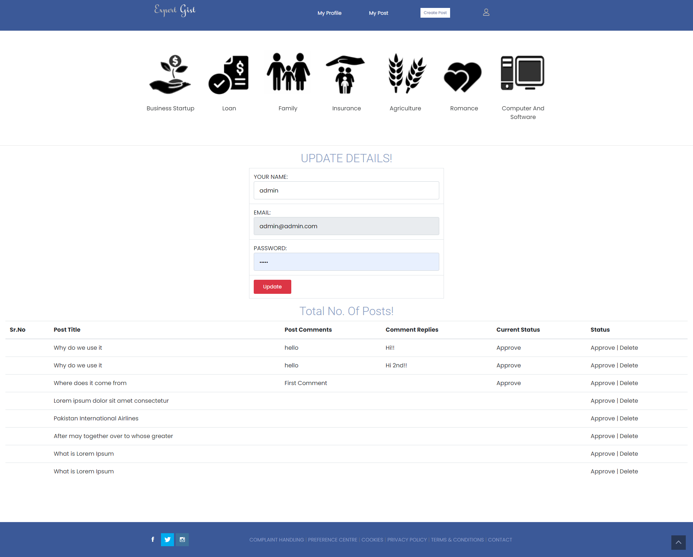
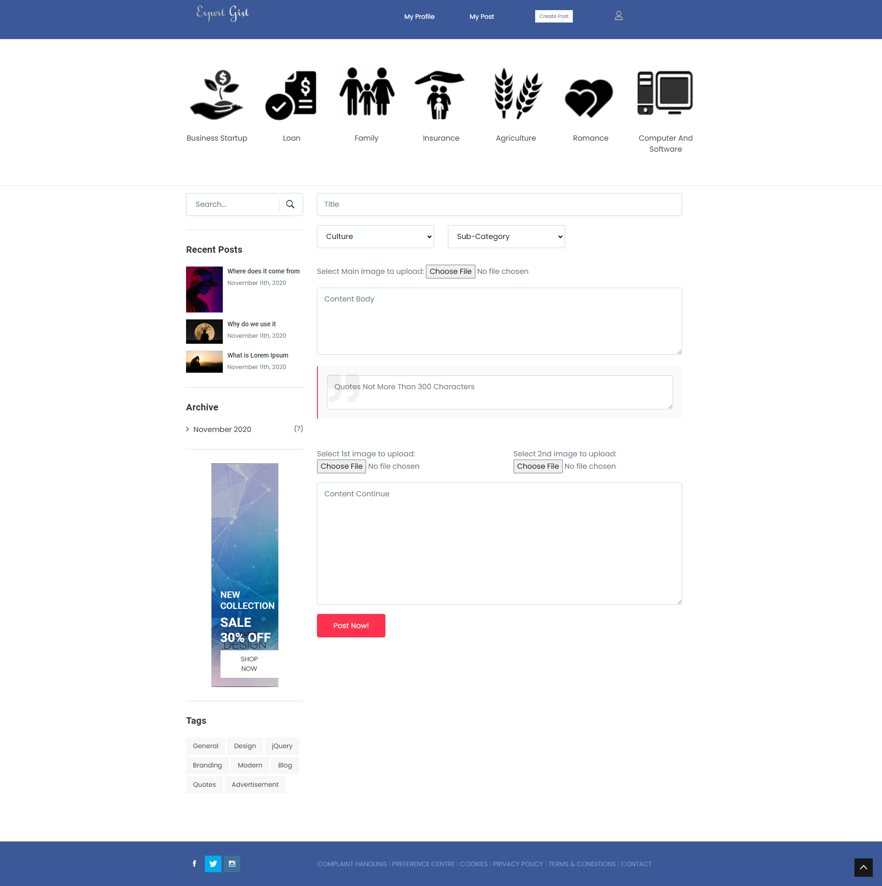

# Project Name

A Php MySql Based Blog

## Table of Contents

- [Features](#features)
- [Installation](#installation)
- [Usage](#usage)
- [Credentials](#credentials)
- [License](#license)

## Features

  - User authentication
  - Blog Posting

## Installation

To install the project:

1. Download the repository
2. The repository has the MySql file. Import the Mysql database and change the database credentials in config file.

## Usage

## Credentials
Email: admin@admin.com
Password: admin

